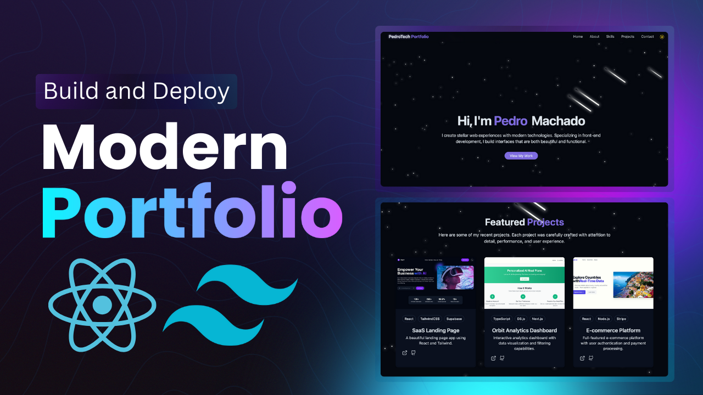

# Jose Flores - Portfolio Website

<div align="center">
  <br />
  
  <br />
  <div>
    
    
    
    
    
  </div>
  <h3 align="center">Personal Portfolio of Jose Flores - UC Berkeley Applied Mathematics Student & Aspiring Data Scientist</h3>
  <br />
</div>

## 📋 Table of Contents

1. [Introduction](#-introduction)
2. [Tech Stack](#-tech-stack)
3. [Features](#-features)
4. [Quick Start](#-quick-start)
5. [Screenshots](#-screenshots)
6. [Deployment](#-deployment)

---

## 🚀 Introduction

Welcome to my personal portfolio website! I'm Jose Flores, a third-year UC Berkeley student pursuing Applied Mathematics with a passion for data science and frontend development. This modern portfolio showcases my journey, skills, and projects as I work towards becoming a versatile Data Scientist.

Currently, I'm enhancing my skills as an AI & Frontend Student Developer at Assist.org, where I'm gaining hands-on experience in web development and artificial intelligence applications.

---

## ⚙️ Tech Stack

* **React** – Component-based UI development
* **Vite** – Lightning-fast build tool
* **TailwindCSS** – Utility-first CSS for styling
* **Lucide Icons** – Clean and beautiful icon pack
* **Radix UI** – Accessible component primitives
* **TypeScript (optional)** – Type safety and tooling
* **GitHub & Vercel** – Deployment

---

## ⚡️ Features


* 💫 **Animated Backgrounds**
  Stars, meteors, scroll effects, and glowing UI elements

* 📱 **Responsive Navigation**
  Desktop and mobile menus with glassmorphism

* 👨‍💻 **Hero & About Sections**
  Showcase who you are with smooth intro animations and buttons


* 🖼️ **Projects Showcase**
  Display screenshots, tech stacks, and GitHub/demo links

* 📩 **Contact Section**
  Social icons + responsive contact form with toast notifications


---

## 👌 Quick Start

### Prerequisites

* [Node.js](https://nodejs.org/)
* [Git](https://git-scm.com/)

### Clone and Run

```bash
git clone https://github.com/joseflores/JoseFlores-portfolio.git
cd JoseFlores-portfolio
npm install
npm run dev
```

Your app will be available at: [http://localhost:5173](http://localhost:5173)

---

---

Your live website will be hosted on a custom subdomain (e.g. `https://jose-flores.vercel.app`)

---

## 🎓 About Jose Flores

- **Education**: UC Berkeley, Applied Mathematics (3rd year)
- **Current Role**: AI & Frontend Student Developer at Assist.org
- **Career Goal**: Aspiring Data Scientist
- **Focus Areas**: Data Science, Frontend Development, AI Applications

---

## 🔗 Useful Links

* [React Documentation](https://reactjs.org/)
* [Tailwind CSS Docs](https://tailwindcss.com/)
* [Lucide Icons](https://lucide.dev/)
* [Radix UI](https://www.radix-ui.com/)
* [Vite](https://vitejs.dev/)


---
